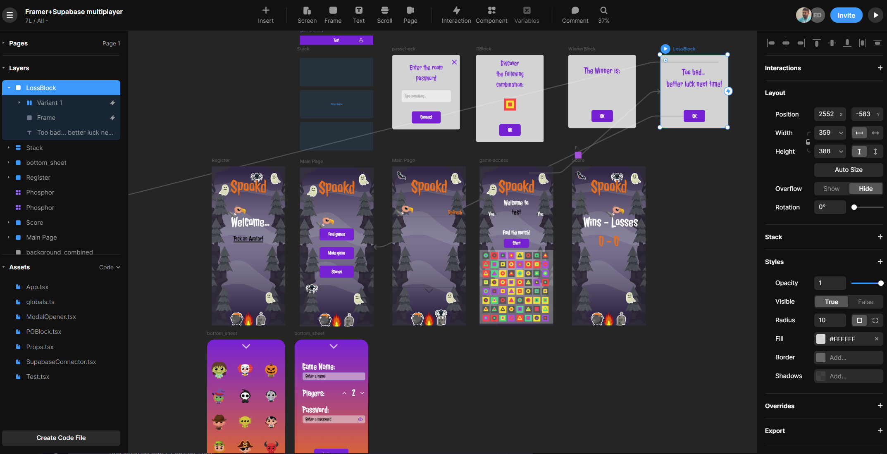
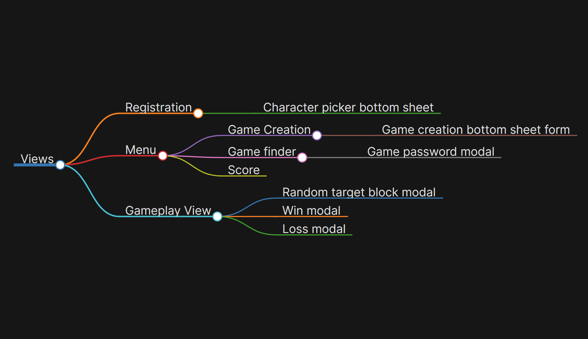
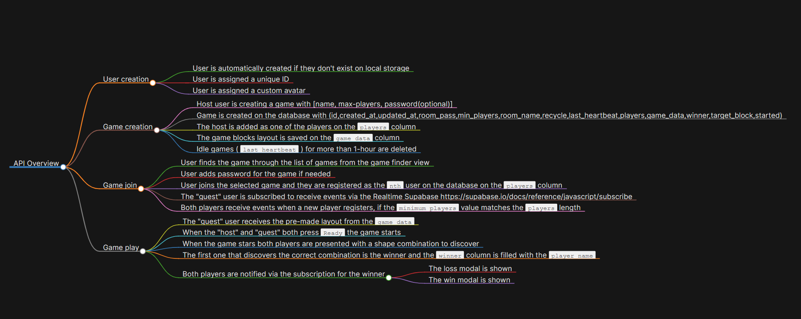

# Spookd

A Framer prototype game with Supabase as backend

 

# Prototype Views (Framer)

## Registration

- Character picker bottom sheet

## Menu

- Game Creation
  - Game creation bottom sheet form
- Game finder
  - Game password modal
- Score

## Gameplay View

- Random target block modal
- Win modal
- Loss modal

---
### Mindmap

---

# API Overview

## User creation

- User is automatically created if they don't exist on local storage
- User is assigned a unique ID
- User is assigned a custom avatar

## Game creation

- Host user is creating a game with [name, max-players, password(optional)]
- Game is created on the database with (id,created_at,updated_at,room_pass,min_players,room_name,recycle,last_heartbeat,players,game_data,winner,target_block,started)
- The host is added as one of the players on the `players` column
- The game blocks layout is saved on the `game_data` column
- Idle games ( `last_heartbeat` ) for more than 1-hour are deleted

## Game join

- User finds the game through the list of games from the game finder view
- User adds password for the game if needed
- User joins the selected game and they are registered as the `nth` user on the database on the `players` column
- The "guest" user is subscribed to receive events via the Realtime Supabase https://supabase.io/docs/reference/javascript/subscribe
- Both players receive events when a new player registers, if the `minimum_players` value matches the `players` length

## Game play

- The "guest" user receives the pre-made layout from the `game_data`
- When the "host" and "guest" both press `Ready` the game starts
- When the game stars both players are presented with a shape combination to discover
- The first one that discovers the correct combination is the winner and the `winner` column is filled with the `player_name`
- Both players are notified via the subscription for the winner
  - The loss modal is shown
  - The win modal is shown
  
---
### Mindmap

