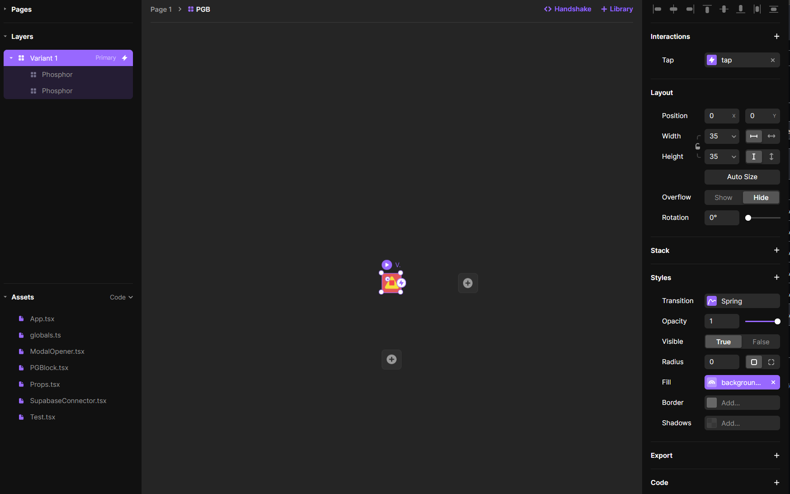
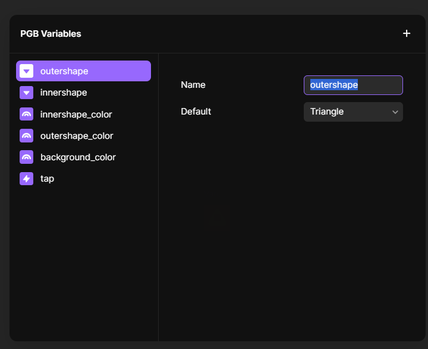

# Spookd 
 

A Framer prototype game with Supabase as backend

This is a proof of concept project, to showcase how can a multiplayer game be created via any UI and a Supabase db.

Using the DB to store data and the realtime communication (through websockets) to broadcast events.
 
This game features:

- Creating user accounts
- Creating game lobby
- Joining game
- Playing and receiving gameplay events (player ready, win, loss, shared game data)


https://user-images.githubusercontent.com/864248/136512258-004e1618-d975-4f23-bbeb-67a552dccd93.mp4

```
Gameplay instructions:
- Pick an avatar
- Make or Join a game (put 1 player to play a solo challenge)
- Press Start to indicate that you are ready to play
```
### Prefered platform: `Mobile`
## Gameplay link: https://framer.com/share/Framer-Supabase-multiplayer--1rmYcBAnSk0PVvXGrnlc/e0t612XvT?fullscreen=1
<br>

## Vocal brief description of the project: https://www.youtube.com/watch?v=8SsWL3unwGI


# Documentation


---
### The random blocks (PGB - Procedurally Generated Blocks) are smart components with 3 shapes inside and variable colors/shapes








# Prototype Views (Framer)

## Registration

- Character picker bottom sheet

## Menu

- Game Creation
  - Game creation bottom sheet form
- Game finder
  - Game password modal
- Score

## Gameplay View

- Random target block modal
- Win modal
- Loss modal

---
### Mindmap


---

# API Overview

## User creation

- User is automatically created if they don't exist on local storage
- User is assigned a unique ID
- User is assigned a custom avatar

## Game creation

- Host user is creating a game with [name, max-players, password(optional)]
- Game is created on the database with (id,created_at,updated_at,room_pass,min_players,room_name,recycle,last_heartbeat,players,game_data,winner,target_block,started)
- The host is added as one of the players on the `players` column
- The game blocks layout is saved on the `game_data` column
- Idle games ( `last_heartbeat` ) for more than 1-hour are deleted

## Game join

- User finds the game through the list of games from the game finder view
- User adds password for the game if needed
- User joins the selected game and they are registered as the `nth` user on the database on the `players` column
- The "guest" user is subscribed to receive events via the Realtime Supabase https://supabase.io/docs/reference/javascript/subscribe
- Both players receive events when a new player registers, if the `minimum_players` value matches the `players` length

## Game play

- The "guest" user receives the pre-made layout from the `game_data`
- When the "host" and "guest" both press `Ready` the game starts
- When the game stars both players are presented with a shape combination to discover
- The first one that discovers the correct combination is the winner and the `winner` column is filled with the `player_name`
- Both players are notified via the subscription for the winner
  - The loss modal is shown
  - The win modal is shown
  
---
### Mindmap


## Clean up
- Right now clients are responsible of cleaning up idle games that their `last_heartbeat` is over 1 hour.
- Games also get removed after a winner has been declared but users refreshing the page or navigating away can leave the game in an idle state. In the future a dedicated server or Supabase function with a cron job could be responsible for handling these leftovers.
---
## Team
```
Michael Dobekidis
Twitter: @netgfx
Github: https://github.com/netgfx
```
